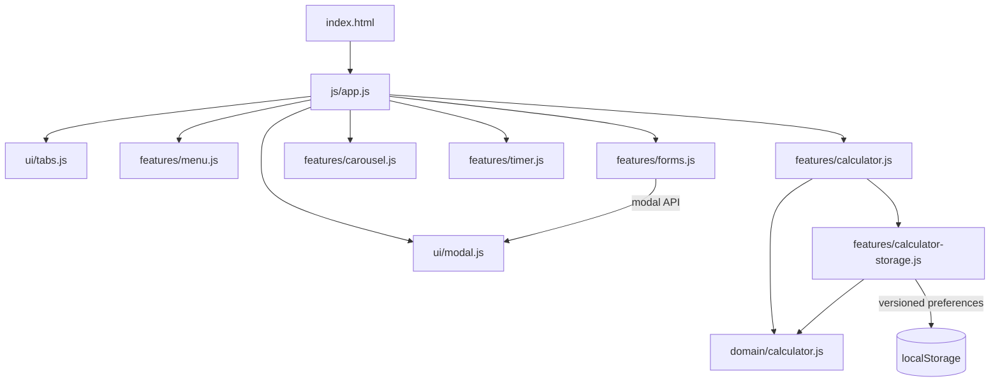

# Architecture

## Goals

NourishFlow optimizes for four things:

1. **Traceability** — a developer should be able to find where behavior lives quickly.
2. **Native platform leverage** — prefer HTML/CSS/browser APIs over custom infrastructure.
3. **Testability** — business rules should be testable without a browser where practical.
4. **Proportionality** — architecture should match a small static product, not imitate an enterprise backend.

## Module map



## Composition root

`js/app.js` owns initialization order and is intentionally small. It wires features together rather than implementing feature behavior.

This avoids:

- hidden initialization through global side effects;
- a global event bus;
- dependency-injection containers;
- framework lifecycle coupling.

## UI modules

### Tabs

`ui/tabs.js` owns the eating-style tab state and keyboard model.

The DOM carries the semantics through `tablist`, `tab`, and `tabpanel`. JavaScript synchronizes selected state, panel visibility, and roving focus.

### Dialog

`ui/modal.js` delegates modality to the native `<dialog>` API.

JavaScript only adds application-specific concerns:

- which actions open it;
- initial focus;
- status view;
- deterministic focus restoration.

It does not recreate browser modality, Escape handling, or background inertness.

## Feature modules

### Carousel

The carousel stores a single active slide index. Movement uses percentage transforms, so state does not depend on measured pixel widths and survives viewport changes.

### Menu

Menu data is local, static product-demo data. Cards are created with DOM APIs rather than HTML string injection.

### Forms

Forms are explicitly local-only demonstrations. Native constraint validation is used and no network/persistence layer exists.

### Weekly countdown

`features/timer.js` owns the informational menu-refresh countdown. It derives the next Monday 09:00 deadline from the viewer's local calendar instead of storing a fixed historical date. Remaining time is clamped at zero and the deadline rolls forward automatically after each weekly boundary.

The timer has no persistence and no product-critical side effects; it is a presentation feature driven by the current clock.

### Calculator

The calculator is split into three responsibilities:

- `domain/calculator.js` — pure validation and calculation;
- `features/calculator-storage.js` — versioned preference persistence/migration;
- `features/calculator.js` — DOM/controller boundary.

The domain layer cannot access `window`, `document`, or `localStorage`.

## CSS architecture

The stylesheet uses ordered cascade layers:

```text
reset → tokens → base → layout → components → utilities → responsive
```

The responsive model is mobile-first. Layout uses fluid containers, Grid/Flexbox, logical properties, `minmax()`, and `clamp()` instead of the original fixed desktop dimensions.

## Data boundaries

NourishFlow has no production API and no remote persistence.

The only persisted state is calculator preference data in a versioned local-storage object. Personal details entered into demo request forms are neither transmitted nor stored.

## Deliberate non-goals

- framework migration;
- backend simulation;
- global state library;
- custom design-system package;
- repository/service/factory layers for static local data;
- autoplay interactions;
- fabricated scarcity or discount deadlines.

These would add more code and conceptual load than product value at this scale.
