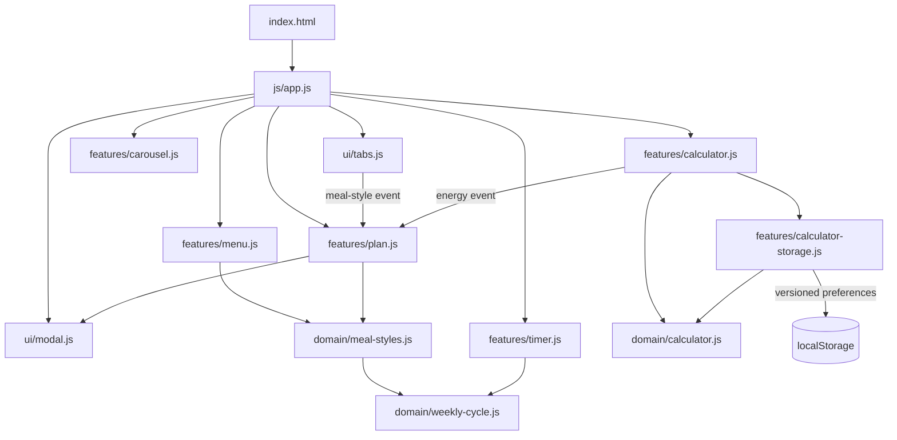

# Architecture

## Goals

NourishFlow optimizes for four things:

1. **Traceability** — behavior should be easy to locate.
2. **Native platform leverage** — prefer HTML, CSS, and browser APIs over custom infrastructure.
3. **Testability** — product rules should stay browser-independent where practical.
4. **Proportionality** — architecture should match a small privacy-first nutrition product.

## Module map



## Composition root

`js/app.js` owns initialization order and wiring only. It contains no DOM querying, persistence, or product rules.

This avoids hidden initialization, global event buses, dependency-injection containers, and framework lifecycle coupling.

## Domain modules

### Calculator

`domain/calculator.js` contains pure validation and calorie-estimate logic. It cannot access `window`, `document`, or storage.

### Meal styles

`domain/meal-styles.js` is the canonical meal-style model for Fitness, Premium, Vegetarian, and Balanced. It also selects each style's weekly idea.

### Weekly cycle

`domain/weekly-cycle.js` defines the shared Monday 09:00 local-time boundary used by both the countdown and weekly meal rotation. Keeping this boundary in one domain module prevents the UI promise and the rendered menu from drifting apart.

## UI modules

### Tabs

`ui/tabs.js` owns the WAI-style tab state and keyboard model. The tablist precedes tabpanels in DOM order, while CSS controls the visual desktop placement. Activation publishes the selected meal-style id as a small product event.

### Dialog

`ui/modal.js` delegates modality to native `<dialog>`. JavaScript adds only open/close behavior, initial focus, and deterministic focus restoration.

## Feature modules

### Menu

`features/menu.js` renders four weekly meal ideas from the canonical meal-style domain. It rerenders when the weekly boundary event fires.

### Plan

`features/plan.js` combines selected meal style, current energy estimate, and this week's idea into a useful local summary. It requests no personal information and can copy the summary to the clipboard.

### Carousel

The carousel stores a single active slide index and uses percentage transforms, so state does not depend on measured pixel widths.

### Weekly countdown

`features/timer.js` presents the next shared weekly boundary and publishes a refresh event after rollover.

### Calculator

The calculator is split into:

- `domain/calculator.js` — pure validation and calculation;
- `features/calculator-storage.js` — versioned preference persistence and migration;
- `features/calculator.js` — DOM/controller boundary.

The storage adapter migrates the previous NourishFlow key and preserves unknown future schema versions instead of destructively downgrading them.

## CSS architecture

The stylesheet uses ordered cascade layers:

```text
reset → tokens → base → layout → components → utilities → responsive
```

The responsive model is mobile-first. Layout uses fluid containers, Grid/Flexbox, logical properties, `minmax()`, and `clamp()`.

## Data and privacy boundaries

NourishFlow has no production API and no remote persistence.

The only persisted state is calculator preference data in a versioned local-storage object. The plan is derived locally and contains no name, phone number, account, or other personal profile data.

## Deliberate non-goals

- framework migration;
- backend simulation;
- authentication;
- global state library;
- custom design-system package;
- repository/service/factory layers for static local data;
- autoplay interactions;
- fabricated scarcity or discount deadlines.

These would add conceptual load without improving the current product problem.
