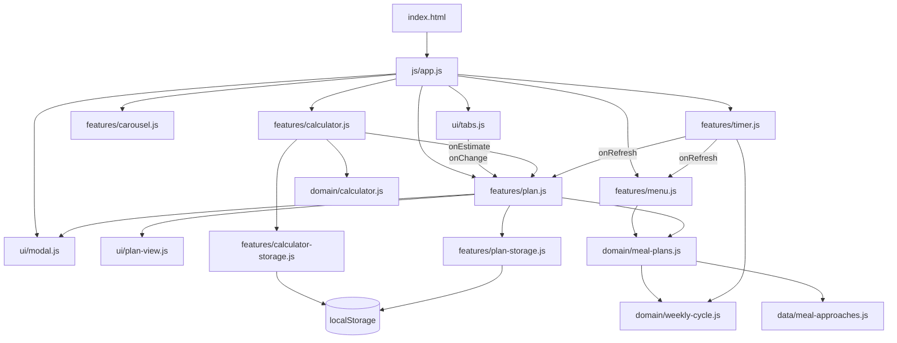

# Architecture

## Goals

NourishFlow optimizes for:

1. **Product coherence** — each screen should contribute to one planning flow.
2. **Traceability** — behavior and state ownership should be obvious from the module map.
3. **Native platform leverage** — prefer HTML, CSS, and browser APIs over custom infrastructure.
4. **Testability** — product rules remain browser-independent where practical.
5. **Proportionality** — the architecture stays smaller than the problem it solves.

## Module map



## Composition root

`js/app.js` owns cross-feature wiring and initialization order.

Feature modules expose small callback-oriented APIs instead of coordinating through a document-level event bus:

- `initTabs({ onChange })`;
- `initCalculator({ onEstimate })`;
- `initTimer({ onRefresh })`;
- `initMenu()` returns a renderer;
- `initPlan()` returns `setApproach`, `setCalories`, `refreshWeekly`, and a small saved-plan UI reset hook.

The composition root contains no DOM queries, storage access, or product calculations.

## Domain modules

### Calculator

`domain/calculator.js` contains pure validation and the preserved revised Harris–Benedict calculation. It cannot access `window`, `document`, or storage.

### Meal approaches and weekly plans

`data/meal-approaches.js` owns the authored content for:

- Whole-Food;
- Mediterranean;
- Plant-Based;
- Balanced.

Each approach has four authored weekly variants. Every variant contains:

- a title and summary;
- Morning, Midday, and Evening meal ideas;
- a small shopping starter.

The authored data is immutable. `domain/meal-plans.js` owns selection rules: approach lookup, four-week variant selection, and the current plan set. The same data drives generated weekly cards and the plan dialog. Static first-screen tabs are guarded by tests that verify their labels, images, and descriptions against the canonical model so HTML/data drift is caught.

### Weekly cycle

`domain/weekly-cycle.js` defines the local Monday 09:00 boundary shared by menu rotation and the countdown.

The timer displays days, hours, and minutes rather than promotion-style seconds.

## UI modules

### Tabs

`ui/tabs.js` owns roving tabindex, selected state, panel visibility, and the vertical keyboard model. It reports the selected approach through an explicit callback.

### Dialog

`ui/modal.js` delegates modality to native `<dialog>` and adds only explicit open/close behavior, initial focus, and focus restoration.

### Plan view

`ui/plan-view.js` owns plan DOM rendering and status output. `features/plan.js` keeps application state and actions, so rendering concerns do not grow inside the controller.

## Feature modules

### Menu

`features/menu.js` renders the four current weekly approach cards from domain data and exposes a `render()` method to the composition root.

### Plan

`features/plan.js` owns the ephemeral current plan:

- selected approach;
- optional energy estimate;
- alternative-plan offset;
- rendered three-meal set;
- shopping starter.

It can produce another authored set, copy the plan, save one plan locally, reopen the saved snapshot, preserve the saved approach when requesting another set, and remove the saved snapshot.

### Plan persistence

`features/plan-storage.js` validates and stores one versioned plan snapshot under `nourishflow.saved-plan`.

The current schema is v2. Valid v1 records using the previous `styleId/styleLabel` field names are migrated once to `approachId/approachLabel`. Unsupported future versions are ignored without destructive overwrite, and malformed data is rejected.

### Carousel

The carousel stores a single active index, uses percentage transforms, has no autoplay, and exposes visible planning tips rather than decorative imagery alone.

### Calculator

The calculator is split into:

- `domain/calculator.js` — pure rules;
- `features/calculator-storage.js` — versioned preference persistence and migration;
- `features/calculator.js` — DOM/controller boundary.

### Weekly countdown

`features/timer.js` reads the shared weekly domain and reports boundary rollover through a callback. It has no knowledge of menus or plans.

## CSS architecture

The stylesheet uses ordered cascade layers:

```text
reset → tokens → base → layout → components → utilities → responsive
```

The responsive model is mobile-first and uses fluid containers, Grid/Flexbox, logical properties, `minmax()`, and `clamp()`.

The visual system intentionally remains close to the original product: white, pale blue, pale yellow, dark text, and one bright-green accent.

## Data and privacy boundaries

There is no production API and no remote persistence.

Local storage contains only:

- calculator preferences;
- one user-saved plan snapshot.

Users can remove the saved plan independently or clear all NourishFlow-owned local data. The product does not collect personal identity information.

## Deliberate non-goals

- framework migration;
- backend simulation;
- authentication;
- global state library;
- cloud plan history;
- automated grocery quantities;
- medical or diet-prescription claims;
- autoplay interactions;
- fabricated scarcity.

These would add conceptual or product risk without improving the current use case.
